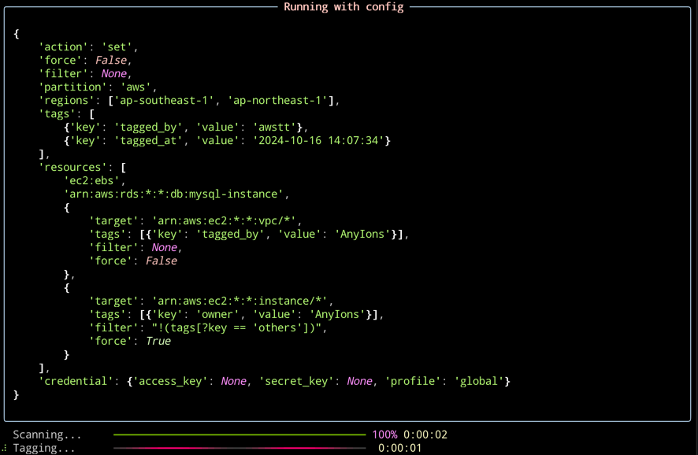

<div align="center">

# AWS Tag Tools: The unified tag manager for AWS resources




English | [简体中文](README_zh_CN.md)
</div>
<br />

## About

AWS Tag Tools is a powerful and versatile tool designed to manage tags for AWS resources across various services. With
this tool, you can effortlessly set or unset tags for multiple resources across multiple regions in a single command, or
use the tool to list matched resources in bulk in multiple regions, based on tag key/value or other specifications
such as EC2 instance type.

## Features

- Support usage in CLI or as an AWS Lambda Function.
- Support multiple AWS services, see the [supported services](docs/en_US/Supported-Services.md) for a detailed list.
- Support AWS partitions: 'aws', 'aws-gov', and 'aws-cn'.
- Filter or select resources using [JMESPath](https://jmespath.org/) expression,
  see [Use Condition](docs/en_US/Use-Selector.md).
- Support Python expression for keys or values, see [Use Expression](docs/en_US/Use-Expression.md).
- Ignore tags when the key exists or logs the original value when force overwrite.
- Log the original key/value when unset tags.
- Log information to file with optional.

## Usage

### Prerequisites

- Requires Python version 3.11 or higher.
- Configured AWS CLI credentials are required if not explicitly specified.
- An IAM Role with permissions for the specified AWS services. For example, to tag an Amazon EC2 instance, you must have
  the following permissions:
    - ec2:DescribeInstances
    - ec2:CreateTags
    - tag:TagResource

### Install

```bash
pip install -U aws-tag-tools
```

### Command

```shell
# Tag any supported resources in all regions
awstt set --tag tagged_by=awstt
# Tag EC2 instances in the 'us-east-1' and 'us-west-1' regions with two tags: 'tagged_by=awstt' and 'owner=AnyIons'
awstt set --tag tagged_by=awstt,owner=AnyIons --region us-east-1,us-west-1 --resource ec2:instance
# Untag tags with keys in ['tagged_by', 'owner'] from any VPCs in the 'aws-cn' partition with a named AWS CLI credential profile
awstt unset --tag tagged_by,owner --resource arn:aws-cn:ec2:*:*:vpc/* --profile china
# Untag tags with the key 'owner' from RDS instances with the specification 'Engine' is 'mysql'
awstt unset --tag owner --resource rds:instance --filter spec[?Engine=='mysql']
# List all resources that have a tag with the key 'created_at' created 5 days ago by comparing the value to a dynamic expression
awstt list --filter tags[?key=='created_at' && value < '${(now() + timedelta(days=-5)).strftime('%Y-%m-%d_%H:%M:%S')}']
# execute action with config file and AK/SK
awstt exec --config action.json --access_key YOUR_AWS_ACCESS_KEY_ID --access_key YOUR_AWS_SECRET_ACCESS_KEY
```

> [!TIP]
> use `awstt --help` to get more details

### Complex Usage

You can use json configuration files for complex operations such as forcing 'owner=AnyIons' tags on all resources but
not allowing overwrite existing 'owner' tags for EC2 instances, and tags 'env=dev' on RDS only in the same time.

See [action-set-example](examples/action-set.json) and [action-unset-example](examples/action-unset.json).

> [!WARNING]
> Override global unset tags with resource unset tag selectors is not supported yet. For examples:
>
> ```json
> {
>   "tags": [
>     "owner"
>   ],
>   "resources": [
>     {
>       "target": "arn:aws:ec2:*:*:volume/*",
>       "tags": [
>         "tags[?key=='owner' && value == 'aws-tag-tools'].key"
>       ]
>     }
>   ]
> } 
> ```
> This tag selector `"tags[?key=='owner' && value == 'aws-tag-tools'].key"` will not affect, all tags with
> key `'owner'` will be unsetted.

## License

[MIT](./LICENSE) License © 2020 [AnyIons](https://github.com/anyions)